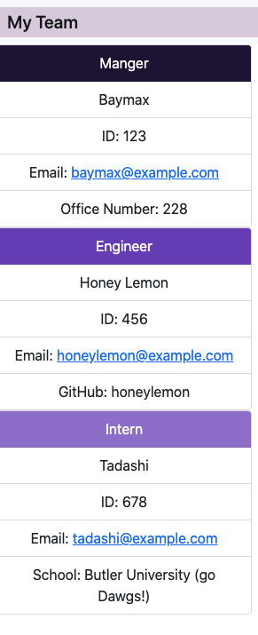

# challenge-10-OOP-team-profile-generator

  ## Description
  Your challenge is to create an application called Note Taker that can be used to write and save notes. This application will use an Express.js back end and will save and retrieve note data from a JSON file.

  ## Table of Contents 
  * [Installation](#installation)
  * [Usage](#usage)
  * [BuiltWith](#builtwith)
  * [Acceptance](#acceptance)
  * [Contributing](#contributing)
  * [Screenshots](#screenshots)
  * [WalkThrough](#walkthrough)
  * [Resources](#resources)
  * [Questions](#questions)


  ## Installation
  npm install
  node index.js

  ## Usage
  ```
  AS A manager
  I WANT to generate a webpage that displays my team's basic info
  SO THAT I have quick access to their emails and GitHub profiles
  ```

  ## BuiltWith
  * HTML
  * CSS
  * Bootstrap
  * JavaScript
  * Inquirer

  ## Acceptance
  ```
  GIVEN a command-line application that accepts user input
  WHEN I am prompted for my team members and their information
  THEN an HTML file is generated that displays a nicely formatted team roster based on user input
  WHEN I click on an email address in the HTML
  THEN my default email program opens and populates the TO field of the email with the address
  WHEN I click on the GitHub username
  THEN that GitHub profile opens in a new tab
  WHEN I start the application
  THEN I am prompted to enter the team manager’s name, employee ID, email address, and office number
  WHEN I enter the team manager’s name, employee ID, email address, and office number
  THEN I am presented with a menu with the option to add an engineer or an intern or to finish building my team
  WHEN I select the engineer option
  THEN I am prompted to enter the engineer’s name, ID, email, and GitHub username, and I am taken back to the menu
  WHEN I select the intern option
  THEN I am prompted to enter the intern’s name, ID, email, and school, and I am taken back to the menu
  WHEN I decide to finish building my team
  THEN I exit the application, and the HTML is generated
  ```

  ## Contributing
  This project is not open for contributions at this time.

  ## Screenshots
  
  ## WalkThrough

  [Walk Through Example of How the Program Functions](https://drive.google.com/file/d/1GagqkH72N6dfpIynJ-PfOte9eTA0BBup/view)

  ## Resources

  [Inquirer Documentation](https://www.npmjs.com/package/inquirer)

  [Node.js Documentation](https://nodejs.org/en/docs/)

  [Node.js File System](https://nodejs.org/api/fs.html#fs_file_system)

  [Write to File](https://www.geeksforgeeks.org/javascript-program-to-write-data-in-a-text-file/)

  [Bootstrap Documentation](https://getbootstrap.com/docs/5.0/getting-started/introduction/)

  [Bootstrap Cards](https://getbootstrap.com/docs/5.0/components/card/)

  [Bootstrap Colors](https://getbootstrap.com/docs/5.0/customize/color/)

  ## Questions
  GitHub: jerismith32

  Email: jerismith32@gmail.com
